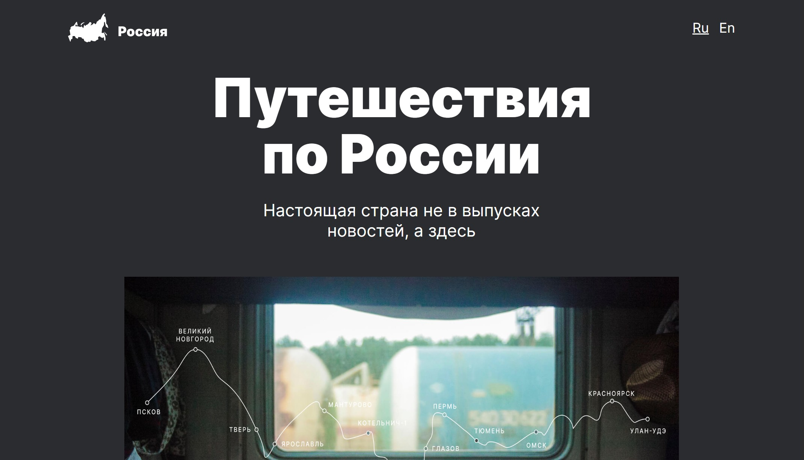

# 🔍 Путешествия по России / Traveling in Russia*

**Путешествия по России / Traveling in Russia** — Проект описывающий интересные места для путишествия по России.

[Демо-страница](https://sanyazola.github.io/russian-travel/)

## Описание

Проект выполнен только на HTML и CSS. Полностью адаптивен. Включает отдельную страницу на английском языке.

### 🚀 Возможности:
- Кликабельные ссылки.
- Адаптивная верстка.
- Галерея с фотографиями интересных мест России.
- Двуязычность: отдельная страница на английском

### Технологии и стек
- Grid-layout.
- Flexbox.
- Структуры БЭМ классов.
- Семантическая верстка.
- Адаптивная верстка через преломление в значених: 1280px, 1024px; 768px; 320px.

